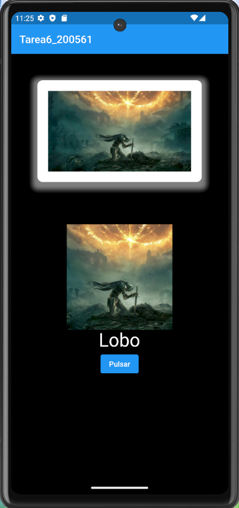
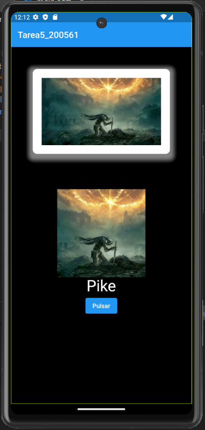

# DMI_Tarea5_200561

  
# Universidad Tecnológica de Xicotepec de Juárez

## Ingeniería en Desarrollo y Gestión de Software
## Elisama Arturo Calva Moreno
## 10A
### Desarrollo Móvil Integral

## Captura de Pantalla

  
  
  

&nbsp;
&nbsp;

|  Característica |  Información |
| :------------: | :------------: |
| Nombre  |  Tarea 5 Aplicación en Flutter y StatelesWidgets |
| Descripción  | Esta aplicación fue creada con Flutter con la finalidad de poder mostrar un ejemplo de una aplicación que utiliza un botón personalizado para cambiar de imagen y un carrusel para también poder cambiar de imágenes. El botón cambia su texto cada vez que el usuario presiona, y el carrusel de imágenes permite al usuario se desplazarse a través de una serie de imágenes. La aplicación utiliza un StatefulWidget para poder mantener el estado interno y demostrar cómo actualizar la interfaz de usuario en respuesta a las interacciones del usuario.  |
|  Fecha de Carga | 21/09/23  |
